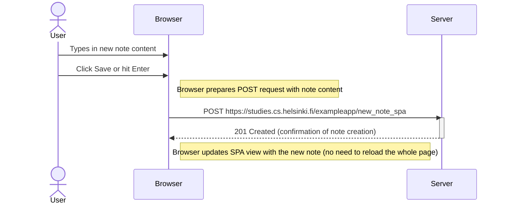

```mermaid
sequenceDiagram
    actor User
    participant Browser
    participant Server

    User->>Browser: Types in new note content
    User->>Browser: Click Save or hit Enter

    Note right of Browser: Browser prepares POST request with note content

    Browser->>Server: POST https://studies.cs.helsinki.fi/exampleapp/new_note_spa
    activate Server
    Server-->>Browser: 201 Created (confirmation of note creation)
    deactivate Server

    Note right of Browser: Browser updates SPA view with the new note (no need to reload the whole page)
```